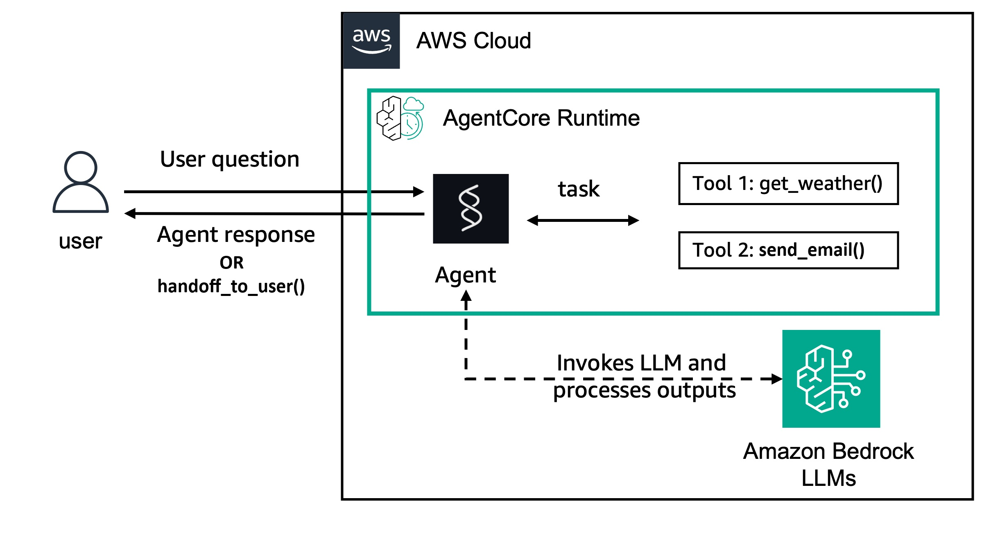

# Human in the loop  (HITL) with Strands Agents on AgentCore Runtime with Amazon Nova Lite 2

## Overview

This tutorial will go over how to host a Strands agent with tools that require human approval, using Amazon Bedrock AgentCore Runtime & Amazon Nova Lite 2.

### Tutorial Details

| Information         | Details                                                                          |
|:--------------------|:---------------------------------------------------------------------------------|
| Tutorial type       | Conversational                                                                   |
| Agent type          | Single                                                                           |
| Agentic Framework   | Strands Agents                                                                   |
| LLM model           | Amazon Nova Lite 2                                                               |
| Tutorial components | Hosting agent on AgentCore Runtime, using a Strands Agent with HITL              |
| Tutorial vertical   | Cross-vertical                                                                   |
| Example complexity  | Medium                                                                           |
| SDK used            | Amazon BedrockAgentCore Python SDK and boto3                                     |

### Tutorial Architecture

In this tutorial we will describe how to create a Strands agent with tools protected by human approval. This will be deployed to. AgentCore runtime. 

For demonstration purposes, we will  use a Strands Agent using Amazon Nova Lite 2.

In our example we will use a very simple agent with two tools: `send_email` and `get_weather`. 

Strand's inherent tool `handoff_to_user` will be used to intercept tool calls in the agent loop. 

    

### Tutorial Key Features

* Hosting Strands Agents on Amazon Bedrock AgentCore Runtime.
* Using Amazon Nova Lite 2.
* Using Strands Agents built in "handoff_to_user" functionality for human-in-the-loop.
